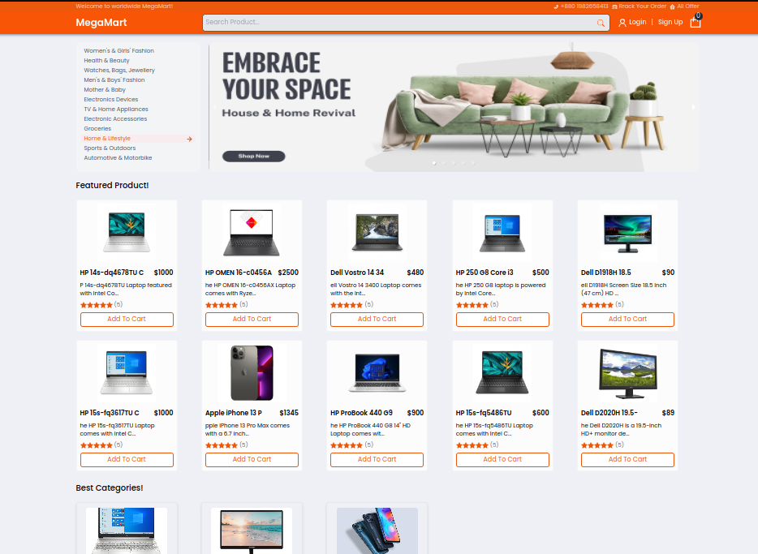

# Megamart E-commerce Website

Welcome to my React Redux eCommerce website! This project is a full-stack e-commerce solution built with React, Redux, Redux-toolkit and various other technologies. Whether you're a developer looking to contribute, a business owner interested in my platform, or just a curious user, this README will guide you through the essential details of my project.



## Table of Contents

- [Features](#features)
- [Technologies Used](#technologies-used)
- [Installation](#installation)
- [Usage](#usage)
- [Contributing](#contributing)
- [License](#license)

## Features

My React Redux megamart eCommerce website features:

- **Product Catalog:** Browse and search for products across various categories.
- **User Authentication:** Register, login, and manage your user profile.
- **Shopping Cart:** Add and remove items from your cart, update quantities, and proceed to checkout.
- **Order Management:** View and manage your order history.
- **Admin Panel:** An admin interface for managing products, categories, and orders.
- **Responsive Design:** A mobile-friendly user interface for a seamless shopping experience on all devices.
- **Payment Integration:** Secure payment processing to complete orders.

## Technologies Used

- **React:** A popular JavaScript library for building user interfaces.
- **Redux:** A state management library for predictable application state.
- **React Router:** For handling navigation within the application. this react router i use (react-router-dom) v6.
- **Node.js:** A JavaScript runtime for building the server-side of the application.
- **Express.js:** A web application framework for building RESTful APIs.
- **Mongoose:** Mongoose is an Object Data Modeling (ODM) library for MongoDB.
- **Stripe:** Payment processing integration for secure transactions.
- **Tailwindcss:** For styling the user interface.

## Installation

To get started with my React Redux eCommerce website, follow these steps:

1. Clone this repository to your local machine using Git.

   ```bash
   git clone https://github.com/sksabbirhossain/megamart-ecommerce.git
   ```

2. Change to the project directory.

   ```bash
   cd megamart-ecommerce
   ```

3. Install server dependencies. (recommended use yarn)

   ```bash
   yarn install
   ```

   Or,

   ```bash
   npm install
   ```

4. Create a `.env` file or rename `.env.dev` to `.env` and add your own configuration based on the provided `.env.dev` file.

5. Start the development server using this command.

   ```bash
   yarn start
   ```

   Or

   ```bash
   npm start
   ```

6. Access the application in your web browser at `http://localhost:3000`.

## Usage

- Visit the deployed website or run the development server (as described in the installation instructions) to access the application.
- Register an account or log in to start shopping.
- Explore the product catalog, add items to your cart, and complete orders.

If you are an admin, access the admin panel to manage products, categories, and orders.

1.  Go to this URL and login as a admin
    ```bash
    http://localhost:3000/admin
    ```
2.  Login your admin account using this information.

    ```bash
    email: admin@gmail.com
    password: 1111
    ```

If your are successfully login as a admin then you can manage everything.

## Contributing

If you have any suggestions on what to improve this website, please make a issue share your ideas and create your pull request.

## License

This project is licensed under the [MIT License](LICENSE.md). Feel free to use, modify, and distribute it as per the terms of the license.

Enjoy your shopping experience with my MegaMart E-commerce website! If you have any questions or encounter any issues, please create a issue or [contact me](https://www.linkedin.com/in/sk-sabbir-hossain/).

## server side code is here.

```bash
    https://github.com/sksabbirhossain/megamart-ecommerce-server.git
```
